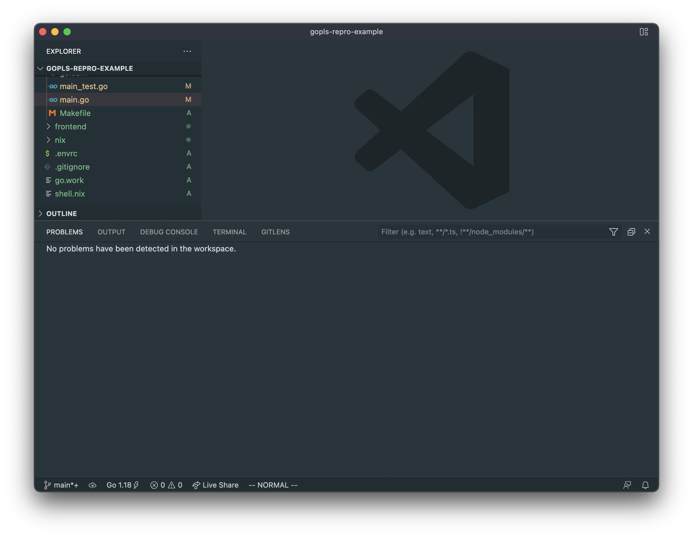
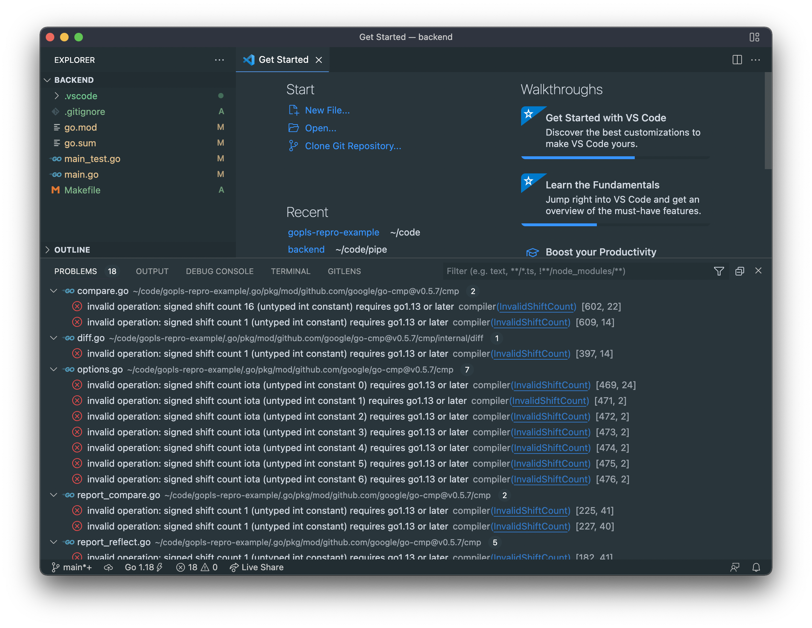
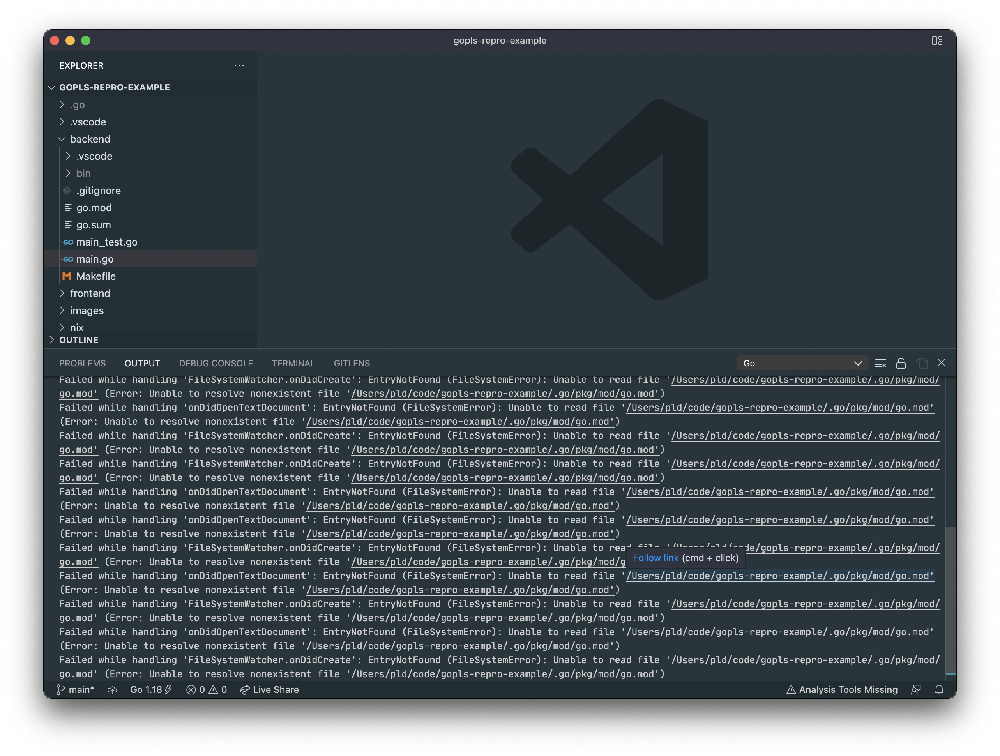

# gopls-repro-example

Minimal viable golang monorepo project to demonstrate go1.18 workspace issues.

Contains a nix shell file to make reproducing issues easier. Setting up nix is
outside of scope of this repo but if you have it already installed, `nix-shell`
will launch a shell with `go@1.8` and `gopls@0.8.1`.

All errors reported against VSCode with the following version information:

```
Version: 1.65.2 (Universal)
Commit: c722ca6c7eed3d7987c0d5c3df5c45f6b15e77d1
Date: 2022-03-10T14:33:49.188Z (2 wks ago)
Electron: 13.5.2
Chromium: 91.0.4472.164
Node.js: 14.16.0
V8: 9.1.269.39-electron.0
OS: Darwin arm64 21.3.0
```

## gopls reporting `compiler(InvalidShiftCount)` errors 

### Steps to reproduce

Quit VSCode entirely, set up a shell with `go@1.18` and `gopls@0.8.1`

```bash
cd /path/to/this/repo

# If not using nix, set up GO* env variables
export GOPATH=/path/to/this/repo/.go
export GOROOT=
export PATH=$(go env GOPATH)/bin:$PATH

# Clear old modules and binaries
sudo rm -rf $GOPATH

# Launch VSCode
code .
```

You should see 0 Problems detected in the workspace:



Now launch VSCode inside the `backend` directory. Re-use the same shell as before:

```bash
code backend
```

You should see 18 Problems detected in the workspace, all referencing `InvalidShiftCount`:

```
[{
	"resource": "/Users/pld/code/gopls-repro-example/.go/pkg/mod/github.com/google/go-cmp@v0.5.7/cmp/report_compare.go",
	"owner": "_generated_diagnostic_collection_name_#0",
	"code": {
		"value": "InvalidShiftCount",
		"target": {
			"$mid": 1,
			"external": "https://pkg.go.dev/golang.org/x/tools/internal/typesinternal?utm_source%3Dgopls#InvalidShiftCount",
			"path": "/golang.org/x/tools/internal/typesinternal",
			"scheme": "https",
			"authority": "pkg.go.dev",
			"query": "utm_source=gopls",
			"fragment": "InvalidShiftCount"
		}
	},
	"severity": 8,
	"message": "invalid operation: signed shift count 1 (untyped int constant) requires go1.13 or later",
	"source": "compiler",
	"startLineNumber": 225,
	"startColumn": 41,
	"endLineNumber": 225,
	"endColumn": 42
}]
```



### Expected behavior

I would expect there to be 0 reported problems in both cases.

## vscode-go reporting Unable to read file go.mod in GOMODCACHE

### Steps to reproduce

Quit VSCode entirely, set up a shell with `go@1.18` and `gopls@0.8.1`

```bash
cd /path/to/this/repo

# If not using nix, set up GO* env variables
export GOPATH=/path/to/this/repo/.go
export GOROOT=
export PATH=$(go env GOPATH)/bin:$PATH

# Clear old modules and binaries
sudo rm -rf $GOPATH

# Launch VSCode
code .
```

Now view the `Go` output. You should see a huge number of error lines that all look like the following, complaining about being unable to read a `go.mod` file:

```
Failed while handling 'onDidOpenTextDocument': EntryNotFound (FileSystemError): Unable to read file '/Users/pld/code/gopls-repro-example/.go/pkg/mod/go.mod' (Error: Unable to resolve nonexistent file '/Users/pld/code/gopls-repro-example/.go/pkg/mod/go.mod')
Failed while handling 'FileSystemWatcher.onDidCreate': EntryNotFound (FileSystemError): Unable to read file '/Users/pld/code/gopls-repro-example/.go/pkg/mod/go.mod' (Error: Unable to resolve nonexistent file '/Users/pld/code/gopls-repro-example/.go/pkg/mod/go.mod')
```



### Expected behavor

I would expect that any modules in the `$GOMODCACHE`/`$GOPATH` would not trigger any problems in the vscode-go extension. At work, we use a shared nix config to set `$GOPATH` to `$repoRoot/.go` this way so that our developers do not end up clobbering their system's `$GOMODCACHE`/`$GOPATH` while working on our project.

I have confirmed that setting `$GOPATH` to a folder outside of the repository resolves this problem, but unfortunately it is difficult for us to do that with our direnv/lorri/nix setup.
